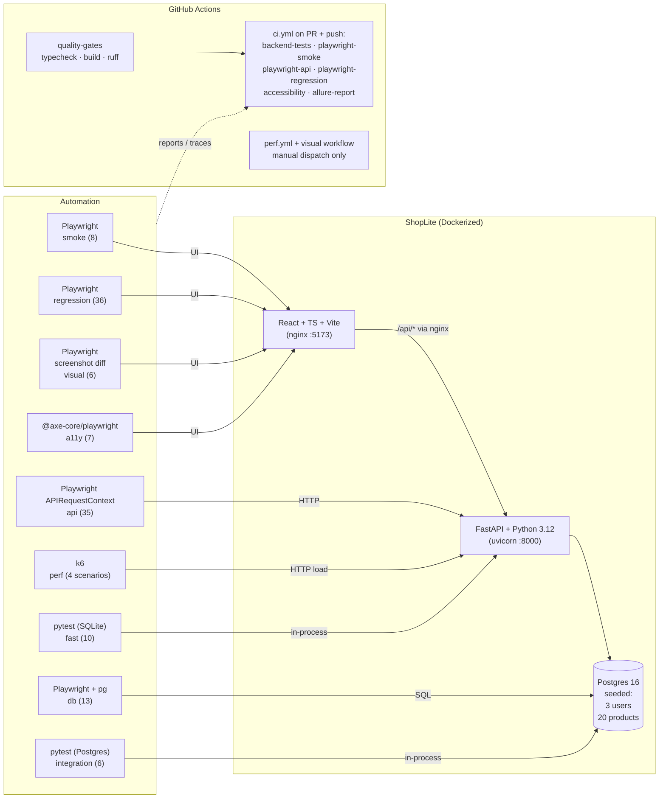

# TestForge

> **TestForge is a production-style QA automation framework for ShopLite, a React/FastAPI e-commerce app. It validates the app across UI, API, database, accessibility, visual regression, performance, CI/CD, reporting, and flake-prevention workflows.**

Built to demonstrate end-to-end SDET ownership — Page Object Model, API setup hooks, deterministic data, parallel CI with quality gates, Allure reporting, accessibility, visual regression, smoke-load scenarios, and real backend hardening (soft-delete catalog, atomic checkout) — all working together against a real product running in Docker.

**Headline:** 120 functional/quality tests + 4 k6 performance scenarios. PR CI runs Chromium with quality-gates first; visual regression and k6 run via manual workflows.

---

## Table of contents

- [Project overview](#project-overview)
- [Why I built this](#why-i-built-this)
- [Tech stack](#tech-stack)
- [Architecture](#architecture)
- [QA strategy](#qa-strategy)
- [Test coverage](#test-coverage)
- [How to run the app](#how-to-run-the-app)
- [How to run the tests](#how-to-run-the-tests)
  - [Smoke tests](#smoke-tests)
  - [Regression tests](#regression-tests)
  - [API tests](#api-tests)
  - [Database tests](#database-tests)
  - [Backend fast API/integration tests (pytest, SQLite)](#backend-fast-apiintegration-tests-pytest-sqlite)
  - [Backend Postgres integration tests (pytest, real Postgres)](#backend-postgres-integration-tests-pytest-real-postgres)
  - [Accessibility tests](#accessibility-tests)
  - [Visual regression tests](#visual-regression-tests)
  - [Performance scenarios (k6)](#performance-scenarios-k6)
- [How to view reports](#how-to-view-reports)
- [CI/CD](#cicd)
- [Screenshots](#screenshots)
- [Security tradeoffs](#security-tradeoffs)
- [Performance testing scope](#performance-testing-scope)
- [Visual regression notes](#visual-regression-notes)
- [Known tradeoffs](#known-tradeoffs)
- [Future improvements](#future-improvements)
- [Resume bullets](#resume-bullets)
- [Repository layout](#repository-layout)
- [QA documentation index](#qa-documentation-index)

---

## Project overview

**ShopLite** is a working e-commerce app:

- **Frontend** — React + TypeScript + Vite, Tailwind, React Query (server state), Zustand (client state). Seven pages: login, products list, product detail, cart, checkout, orders history, admin products.
- **Backend** — FastAPI + Python 3.12, SQLAlchemy 2.x, Alembic migrations, JWT auth, Pydantic v2.
- **Database** — PostgreSQL 16 in Docker. SQLite is used for the *fast* backend pytest layer; real Postgres is used for the *integration* pytest layer (`pytest -m postgres`) and for the rest of the suite.
- **Packaging** — Docker Compose: one command brings up `db + backend + frontend`.

Around that app sits a full SDET stack:

- **Playwright + TypeScript** with Page Object Model, merged fixtures, deterministic factories, per-spec DB reset.
- **API tests** via Playwright's request context — no browser, just contracts.
- **DB validation** via direct Postgres queries.
- **Accessibility** via `@axe-core/playwright`.
- **Visual regression** via Playwright screenshot diffs — Chromium-only, manual baseline regen.
- **Performance scenarios** via k6 against the API hot path — smoke-load benchmark, not capacity testing.
- **Reports**: Playwright HTML + Allure (with failure categories and per-run environment).
- **GitHub Actions CI** with a quality-gates pre-flight (typecheck + build + lint) and parallel test jobs.

---

## Why I built this

I built TestForge to show — in one repository — what senior SDET ownership looks like end-to-end. Not a tutorial fork of someone else's app, and not a framework demo against a public website I don't control. A real (small) product I designed *to be tested*, plus a real automation framework that exercises it across every layer that matters in production.

1. **End-to-end signal in one repo.** Clone, `docker compose up`, ~100 tests pass against a live stack in minutes. No external services, no expired credentials.
2. **Discipline over volume.** Every test is built on the same patterns — POM, API setup hooks, factories, DB reset per spec, web-first assertions, tagged thresholds — and the patterns themselves are written down in [`qa/docs/flake-policy.md`](./qa/docs/flake-policy.md).
3. **Real CI story.** Quality gates (typecheck + build + ruff) run before heavier jobs. Failures upload screenshots, videos, traces, and a merged Allure report. Visual and load tests are deliberately separate from the PR gate — that's the right call at this scope.
4. **Real backend hardening, not just tests.** The checkout uses an atomic `UPDATE ... WHERE stock >= q` to make overselling impossible under concurrency, and admin product deletes are soft (`is_active=false`) so historical orders never break. Both have Postgres-backed tests proving the behavior.
5. **Honest tradeoffs.** The [Security tradeoffs](#security-tradeoffs) and [Known tradeoffs](#known-tradeoffs) sections call out what's intentionally not done, and why.

---

## Tech stack

| Layer        | Tech                                                                 |
|--------------|----------------------------------------------------------------------|
| Frontend     | React 18 + TypeScript (strict) + Vite + Tailwind CSS + React Query + Zustand |
| Backend      | FastAPI + Python 3.12 + SQLAlchemy 2.x + Alembic + Pydantic v2 + JWT (HS256) + bcrypt |
| Database     | PostgreSQL 16 in Docker; SQLite for the fast backend test layer      |
| E2E / API    | Playwright + TypeScript (Page Object Model, merged fixtures, factories) |
| DB tests     | Playwright + `pg` (direct Postgres queries)                          |
| Accessibility| `@axe-core/playwright` (WCAG 2.1 AA, `critical`+`serious` gating)     |
| Visual       | Playwright `toHaveScreenshot()` (Chromium-only, manual baseline regen) |
| Performance  | k6 — tag-scoped p95/error-rate thresholds, smoke-load only           |
| Reports      | Playwright HTML + Allure (categories + environment)                  |
| CI           | GitHub Actions — quality-gates → parallel test jobs → Allure merge   |
| Containers   | Docker + Docker Compose                                              |

---

## Architecture



---

## QA strategy

Full doctrine in [`qa/docs/`](./qa/docs/). Headlines:

- **Test at the lowest layer that can give a confident answer.** Don't drive the UI for something an API test can prove.
- **Deterministic by construction.** Seeded DB, factories for ad-hoc data, DB reset per spec file.
- **API setup hooks, never UI setup.** Tests mint a JWT via `POST /api/auth/login` and inject it into `localStorage` via Playwright init script — UI login is itself a test, not a setup step.
- **Web-first assertions only.** Zero hard waits in the suite. Wait on assertions or specific network events, never a timer.
- **Retries only in CI.** Local `retries = 0`; CI `retries = 2`. Anything failing on retry goes on the quarantine watchlist.
- **Every failure ships triage evidence.** Screenshot, video, trace.
- **Smoke is sacred.** `@smoke` runs on every PR, finishes in minutes, must stay green.

See [`qa/docs/flake-policy.md`](./qa/docs/flake-policy.md) for the full discipline.

---

## Test coverage

| Test type                              | Spec files | Tests | Tagged with    | Where                                                |
|----------------------------------------|------------|------:|----------------|------------------------------------------------------|
| Smoke (UI)                             | 4          | **8** | `@smoke`       | [`qa/e2e/tests/smoke/`](./qa/e2e/tests/smoke/)       |
| Regression (UI)                        | 9          | **36**| `@regression`  | [`qa/e2e/tests/regression/`](./qa/e2e/tests/regression/) |
| API contract                           | 6          | **35**| `@api`         | [`qa/e2e/tests/api/`](./qa/e2e/tests/api/)           |
| DB validation                          | 4          | **12**| `@db`          | [`qa/e2e/tests/db/`](./qa/e2e/tests/db/)             |
| Accessibility                          | 1          | **7** | `@a11y`        | [`qa/e2e/tests/a11y/`](./qa/e2e/tests/a11y/)         |
| Visual                                 | 1          | **6** | `@visual`      | [`qa/e2e/tests/visual/`](./qa/e2e/tests/visual/)     |
| Backend fast API/integration (pytest, SQLite)   | 4          | **10**| pytest         | [`apps/backend/tests/`](./apps/backend/tests/)       |
| Backend Postgres integration (pytest)  | 1          | **6** | `@postgres`    | [`apps/backend/tests/integration/`](./apps/backend/tests/integration/) |
| **Functional / quality total**         | **30**     | **120** |              |                                                      |
| k6 performance scenarios               | 4          | **4** | n/a            | [`qa/perf/`](./qa/perf/)                             |

> **Headline phrasing:** *120 automated functional/quality tests + 4 k6 performance scenarios.* k6 is intentionally counted separately because performance scenarios are smoke-load benchmarks, not functional tests.

Feature × test-type matrix: [`qa/docs/coverage-matrix.md`](./qa/docs/coverage-matrix.md).

---

## How to run the app

```powershell
# Clone, then from the repo root
copy .env.example .env       # optional; defaults are fine
docker compose up --build

# -> http://localhost:5173        frontend (nginx-served React, proxies /api → backend)
# -> http://localhost:8000/health backend (FastAPI direct)
# -> http://localhost:8000/docs   Swagger UI
```

The backend entrypoint runs Alembic migrations and seeds idempotently on every boot.

### Demo-only seed credentials

> These are demo-only seed credentials for the canonical test database. They are not real secrets. Only `.env.example` files are committed; runtime secrets are loaded from environment variables, and `.env` is in `.gitignore`.

| Email                 | Password    | Role  |
|-----------------------|-------------|-------|
| `admin@shoplite.io`   | `admin123`  | admin |
| `user@shoplite.io`    | `user1234`  | user  |
| `alice@shoplite.io`   | `alice123`  | user  |

### Other useful stack commands

```powershell
docker compose down                                            # stop, keep data
docker compose down -v                                         # stop, wipe volume
docker compose exec backend python -m app.seeds.seed --reset   # drop + reseed
docker compose exec db psql -U shoplite -d shoplite            # psql shell
docker compose logs -f backend                                 # tail
```

---

## How to run the tests

One-time setup with the stack already up:

```powershell
cd qa\e2e
npm install
npx playwright install                                          # chromium + firefox + webkit
```

### Smoke tests

The must-pass critical path. Resets the DB, runs cross-browser locally.

```powershell
cd qa\e2e
npm run test:smoke           # node ./scripts/reset-db.mjs && playwright test --grep @smoke --workers=1
```

### Regression tests

Broader UI coverage — cart edge cases, admin authorization, totals consistency end-to-end, protected route redirects.

```powershell
npm run test:regression      # playwright test --grep @regression --workers=1
```

### API tests

Pure contract tests using Playwright's request context — no browser. Cover auth, products, cart, orders, checkout, admin product CRUD.

```powershell
npm run test:api             # playwright test --grep @api --workers=1
```

### Database tests

Direct-Postgres validation (using `pg`) — seed contents, cart row uniqueness, checkout stock decrement, admin product soft-delete persistence, soft-deleted items hidden from public catalog.

```powershell
npm run test:db              # playwright test --grep @db --workers=1
```

### Backend fast API/integration tests (pytest, SQLite)

In-process FastAPI tests using `TestClient` over SQLite. Fast, no Docker needed.

```powershell
cd apps\backend
python -m venv .venv
.\.venv\Scripts\Activate.ps1
pip install -r requirements.txt
pytest -v                    # 10 tests (excludes @postgres-marked)
```

### Backend Postgres integration tests (pytest, real Postgres)

Real-Postgres tests proving transactional behavior SQLite can't fairly model — concurrent oversell protection, transactional rollback, the cart unique-constraint merge. Each test runs in an isolated schema so it can't pollute the dev DB.

```powershell
# Docker stack must be up (Postgres on 127.0.0.1:5433)
pytest -m postgres -v        # 6 tests, opt-in via the marker
```

### Accessibility tests

`@axe-core/playwright` scans every page for `critical` and `serious` WCAG 2.1 AA violations. Suite is green; the audit pass found and fixed 4 color-contrast violations in product code.

```powershell
npm run test:a11y            # playwright test --grep @a11y --workers=1
```

### Visual regression tests

Chromium-only screenshot diffs of 6 key views. Dynamic content (order ids) is masked.

```powershell
npm run test:visual          # assert against baselines
npm run test:visual:update   # regenerate baselines (after intentional UI change)
```

> **Visual regression is Chromium-only.** Local Windows baselines (`*-chromium-win32.png`) are committed for development. Linux CI visual baselines should be regenerated (via the manual `playwright-visual` workflow) before enforcing visual regression in CI.

### Performance scenarios (k6)

Smoke-load benchmark for the API hot path. **Manual only** — they mutate state, are sensitive to runner noise, and would burn CI minutes on every PR. Not production capacity testing.

```powershell
# Stack must be up. k6 via winget/brew/apt, or Docker:
docker run --rm -v "${PWD}/qa/perf:/perf" `
  -e BASE_URL=http://host.docker.internal:8000 `
  grafana/k6 run /perf/products.js

# Once k6 is on PATH:
k6 run qa/perf/products.js
k6 run qa/perf/login.js
k6 run qa/perf/cart.js
k6 run qa/perf/checkout.js
```

Full perf docs: [`qa/perf/README.md`](./qa/perf/README.md).

### Tag-arbitrary and browser-scoped runs

```powershell
npm test                     # full suite (visual excluded from firefox/webkit by config)
npm run test:chromium        # Chromium only
npm run test:firefox         # Firefox only
npm run test:webkit          # WebKit only
npm run test:browsers        # explicit cross-browser run (chromium + firefox + webkit)
npm run test:ui              # Playwright UI mode (interactive)
npm run typecheck            # tsc --noEmit
```

> **Cross-browser coverage:** Playwright is configured for Chromium, Firefox, and WebKit. PR CI runs **Chromium only** for speed. Full cross-browser runs are available locally via `test:browsers`, or via the manual `workflow_dispatch` browser-selector on `ci.yml`.

---

## How to view reports

Every test run produces two reports plus per-failure triage artifacts.

**Playwright HTML report:**

```powershell
cd qa\e2e
npm test
npm run report               # opens playwright-report/index.html
```

**Allure report:**

```powershell
npm test                              # produces allure-results/
npm run report:allure                 # generate + open static
npm run report:allure:serve           # interactive
```

The Allure report ships with `categories.json` (groups failures into *Product defects*, *Test defects*, *Flaky tests*, *Accessibility violations*, *Visual regressions*) and `environment.properties` (base URL, OS, Node, CI flag, run timestamp).

| Artifact   | Mode                | Path                                            |
|------------|---------------------|-------------------------------------------------|
| Screenshot | `only-on-failure`   | `qa/e2e/test-results/<spec>/test-failed-*.png`  |
| Video      | `retain-on-failure` | `qa/e2e/test-results/<spec>/video.webm`         |
| Trace      | `retain-on-failure` | `qa/e2e/test-results/<spec>/trace.zip`          |

Open a trace with `npx playwright show-trace qa\e2e\test-results\<spec>\trace.zip`.

> `allure-results/`, `allure-report/`, `playwright-report/`, and `test-results/` are gitignored — they are *evidence of a run*, not source.

---

## CI/CD

[`.github/workflows/ci.yml`](./.github/workflows/ci.yml) on every push to `main` and every pull request.

### PR CI jobs (run on every PR + push)

| Job                     | What it does                                                                  |
|-------------------------|-------------------------------------------------------------------------------|
| `quality-gates`         | Frontend typecheck + Vite build, qa/e2e TypeScript compile, backend ruff lint |
| `backend-tests`         | `pytest -v` (fast SQLite suite, excludes `@postgres` marker)                  |
| `playwright-smoke`      | Docker stack up → DB reset → `@smoke` on Chromium                             |
| `playwright-api`        | Docker stack up → `@api` on Chromium                                          |
| `playwright-regression` | Docker stack up → `@regression` on Chromium                                   |
| `accessibility`         | Docker stack up → `@a11y` on Chromium                                         |
| `allure-report`         | Downloads every job's `allure-results-*`, merges into one Allure HTML         |

`quality-gates` runs first; `backend-tests` and `playwright-*` only run if it passes.

### Manual workflows (workflow_dispatch only)

| Workflow                     | Trigger                                                                |
|------------------------------|------------------------------------------------------------------------|
| `playwright-visual` (in `ci.yml`) | `run_visual: true` input — used to regenerate Linux baselines      |
| `perf.yml`                   | `script` choice input (`all / products / login / cart / checkout`)     |

**Why visual + perf aren't on the PR gate:** visual baselines are platform-pinned (current ones are Windows); k6 scenarios mutate state and are runner-noise-sensitive.

### Artifacts uploaded per job (always, including on failure)

| Artifact                            | Contents                                              |
|-------------------------------------|-------------------------------------------------------|
| `playwright-report-<suite>`         | Playwright's HTML report for that suite               |
| `allure-results-<suite>`            | Raw Allure JSON (consumed by the merge job)           |
| `test-artifacts-<suite>`            | Screenshots, videos, traces from failed tests         |
| `allure-report`                     | Merged Allure HTML                                    |
| `docker-logs-<suite>`               | `docker compose logs` on failure                      |
| `k6-summaries`                      | `summary-*.json` from each perf scenario              |

Download from the run's **Summary → Artifacts** panel.

---

## Screenshots

Captured from the Playwright visual-regression baselines, so these are exactly what the suite asserts against — no curation. Raw files in [`qa/e2e/tests/visual/pages.visual.spec.ts-snapshots/`](./qa/e2e/tests/visual/pages.visual.spec.ts-snapshots/).

| Login | Products list |
|---|---|
|  |  |
| **Cart** | **Checkout** |
|  |  |
| **Order confirmation** | **Admin products** |
|  |  |

---

## Security tradeoffs

Called out explicitly because pretending a portfolio project is production-ready is a worse signal than admitting where it isn't.

- **JWTs are stored in `localStorage`** via Zustand's `persist` middleware. This is fine for demo simplicity but is a real security tradeoff: any XSS on the site can read the token. In production this would be replaced with **HttpOnly, Secure, SameSite cookies** to keep the token off the JS heap. Documented in [`qa/docs/qa-strategy.md`](./qa/docs/qa-strategy.md).
- **Demo seed credentials are committed** at `apps/backend/app/seeds/seed.py`. They are seed-only — not real secrets — and exist so reviewers can run the suite immediately. Only `.env.example` files are committed; `.env` is gitignored.
- **CORS is permissive** (compose default allows `http://localhost:5173`). In production, the allowlist would be the real origin only.
- **No rate limiting** on `/api/auth/login` — fine for the seeded demo, would be a brute-force vector against real users.
- **Bcrypt cost factor is default** (12). Fine; tunable in production based on the target threat model and login throughput.

---

## Performance testing scope

k6 here is **smoke-load**, not production capacity testing — runs locally or via a manual GitHub Actions workflow against a single-host Docker stack. The numbers prove latency under light, controlled load and catch regressions; they are **not** a representative throughput ceiling.

| Scenario       | Endpoint                  | Profile               | Threshold                                              |
|----------------|---------------------------|------------------------|--------------------------------------------------------|
| `products.js`  | `GET /api/products`       | ramp to 10 VUs, ~35s   | `p(95) < 500ms`, error rate `< 1%`                     |
| `login.js`     | `POST /api/auth/login`    | ramp to 5 VUs, ~35s    | `p(95) < 500ms`, error rate `< 1%`                     |
| `cart.js`      | `POST /api/cart/items`    | ramp to 5 VUs, ~30s    | `p(95) < 500ms`, error rate `< 1%`                     |
| `checkout.js`  | `POST /api/checkout`      | **1 VU constant**, ~30s| `p(95) < 800ms` on checkout call, error rate `< 1%`    |

**Data isolation for checkout.** All k6 scripts authenticate as the single seeded user. For products/login/cart there's no shared mutable state per-VU, so those run with small VU counts. For checkout, two VUs racing on the same cart would produce spurious empty-cart errors — so `checkout.js` runs **1 VU** and clears the cart at the start of every iteration. Each iteration is self-contained: clear → add → checkout.

Full perf docs (install, run, threshold interpretation, design notes): [`qa/perf/README.md`](./qa/perf/README.md).

---

## Visual regression notes

**Status:** Chromium-only. Manual in CI. **Current baselines are local Windows baselines** (`*-chromium-win32.png`). Linux baselines should be regenerated before enforcing visual checks in Ubuntu CI.

The visual suite is therefore **not on the PR gate** — it lives behind the manual `playwright-visual` workflow_dispatch path in `ci.yml`, where you can run it explicitly when you intend to regenerate or compare baselines.

What the suite covers (6 views): login, products list, cart, checkout, order confirmation, admin products form. Dynamic content (the order id on the confirmation panel) is masked via Playwright's pink overlay. Diff tolerance: `maxDiffPixelRatio: 0.01`.

```powershell
cd qa\e2e
npm run test:visual          # assert against baselines (Chromium only)
npm run test:visual:update   # regenerate baselines after an intentional UI change
```

---

## Known tradeoffs

- **A11y suite asserts only on `serious` + `critical`.** `moderate` and `minor` violations aren't gated. Common industry default.
- **Allure CLI needs Java.** Documented prerequisite; the CI workflow installs it.
- **Each Playwright CI job builds its own Docker stack** (~3–5 min per job). Acceptable for portfolio scope.
- **Browser perf is not measured.** k6 covers the API. Frontend perf (LCP, TBT, INP) would be Lighthouse-CI's job — different tool.
- **Quarantine policy aging isn't automated.** The flake doc commits to triaging quarantined tests within 1 working day; the SLA is on paper, not enforced by a workflow yet.
- See also: [Performance testing scope](#performance-testing-scope) and [Visual regression notes](#visual-regression-notes) above.

---

## Future improvements

In rough order of bang-for-buck:

1. **CI status badge** in this README (one-liner once a remote exists).
2. **Linux visual baselines** committed alongside `-win32.png` so visual can rejoin the PR gate.
3. **Allure history on GitHub Pages** for cross-run trend graphs.
4. **Nightly cross-browser cron** — full suite on Firefox + WebKit. PR keeps its fast Chromium-only gate.
5. **Per-VU user isolation in k6** via a registration endpoint — unlocks meaningful concurrent-user throughput numbers.
6. **Lighthouse-CI** for frontend perf metrics.
7. **Stress + soak k6 profiles** as separate workflows.
8. **Auth migration to HttpOnly cookies** — closes the `localStorage` XSS exposure.
9. **Rate-limiting on login** + **OAuth provider option**.

---

## Resume bullets

Copy-paste-ready for an SDET / Senior SDET / QA Engineer resume.

- **Built TestForge, a production-style QA automation framework** validating a React/FastAPI e-commerce app across UI, API, database, accessibility, visual, and performance layers — **120 functional/quality tests + 4 k6 smoke-load scenarios** built on Playwright, pytest (SQLite fast layer + real-Postgres integration layer), axe-core, k6, and Allure.
- **Implemented Page Object Model with merged fixtures** that mint JWTs via API (never via UI login), deterministic factories, per-spec DB reset, and tagged suites (`@smoke`, `@regression`, `@api`, `@db`, `@a11y`, `@visual`, `@postgres`) running across Chromium, Firefox, and WebKit.
- **Hardened backend quality** by adding soft-delete catalog behavior (order history survives product removal), an atomic `UPDATE ... WHERE stock >= q` checkout that makes overselling impossible under concurrency, and Postgres-backed integration tests proving the rollback + concurrent-checkout behavior.
- **Authored a standalone flake-prevention policy** (no hard waits, retry-only-in-CI, seeded data, API setup hooks, quarantine lifecycle, selector hierarchy) with a contributor-runnable audit grep checklist — every rule paired with the file:line it's wired in.
- **Identified and fixed 4 WCAG 2.1 AA color-contrast violations** during the accessibility audit pass; fixed in product code rather than suppressed.
- **Stood up GitHub Actions CI** with a quality-gates pre-flight (frontend typecheck + Vite build, qa/e2e TypeScript compile, backend ruff lint) followed by parallel Playwright suites (smoke, API, regression, accessibility) and a merge job that consolidates per-suite Allure results into one report. Per-failure screenshots, videos, and traces uploaded as artifacts.
- **Wired k6 smoke-load scenarios** for the API hot path with tag-scoped thresholds (p95 < 500ms / 800ms by endpoint, error rate < 1%); manual workflow with a script-selector input and summary JSON artifacts for trend tracking.

---

## Repository layout

```
testforge/
├── .github/workflows/
│   ├── ci.yml                Main CI: quality-gates + backend pytest + 4 Playwright suites + Allure merge
│   └── perf.yml              Manual-only k6 runner
├── docs/screenshots/         Page screenshots used in this README
├── apps/
│   ├── frontend/             React + TS + Vite + Tailwind + React Query + Zustand
│   └── backend/              FastAPI + SQLAlchemy + Alembic + JWT
│       └── tests/
│           ├── test_*.py             Fast API/integration tests (SQLite, TestClient)
│           └── integration/          Postgres integration tests (`pytest -m postgres`)
├── qa/
│   ├── e2e/                  Playwright framework
│   │   ├── pages/                  Page Object Model (8 page objects)
│   │   ├── fixtures/               auth + merged fixtures
│   │   ├── factories/              canonical accounts + factories
│   │   ├── utils/                  api-client.ts, db-client.ts, db-utils.ts, assertions.ts
│   │   ├── tests/                  smoke / regression / api / db / a11y / visual
│   │   ├── allure/categories.json  Committed Allure failure categorization
│   │   ├── scripts/reset-db.mjs    DB reset between specs
│   │   ├── playwright.config.ts
│   │   └── global-setup.ts         /health check + Allure environment.properties
│   ├── perf/                 k6 scenarios (manual)
│   └── docs/                 QA paper trail
├── docker-compose.yml
├── README.md                 this file
├── project.md                exhaustive technical inventory (every metric, file, endpoint)
├── CLAUDE.md                 coding rules for contributors
└── .gitignore
```

---

## QA documentation index

- [`qa/docs/test-plan.md`](./qa/docs/test-plan.md) — scope, environments, entry/exit criteria
- [`qa/docs/coverage-matrix.md`](./qa/docs/coverage-matrix.md) — feature × test-type grid
- [`qa/docs/qa-strategy.md`](./qa/docs/qa-strategy.md) — pyramid, principles, tagging, headline rules, security note
- [`qa/docs/flake-policy.md`](./qa/docs/flake-policy.md) — full flake-prevention discipline
- [`qa/docs/release-checklist.md`](./qa/docs/release-checklist.md) — pre-release gate
- [`qa/docs/bug-report-template.md`](./qa/docs/bug-report-template.md) — bug report shape
- [`qa/perf/README.md`](./qa/perf/README.md) — k6 scenarios, thresholds, design notes, limitations
- [`project.md`](./project.md) — technical inventory (every metric)
- [`CLAUDE.md`](./CLAUDE.md) — coding rules for contributors
