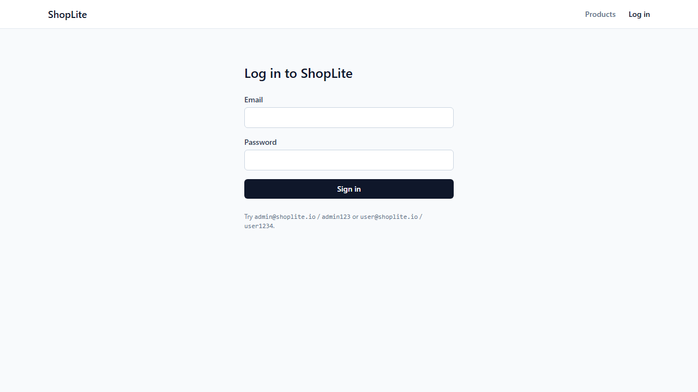
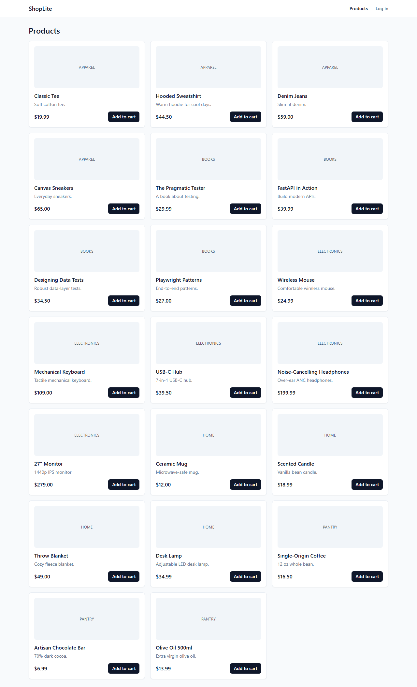
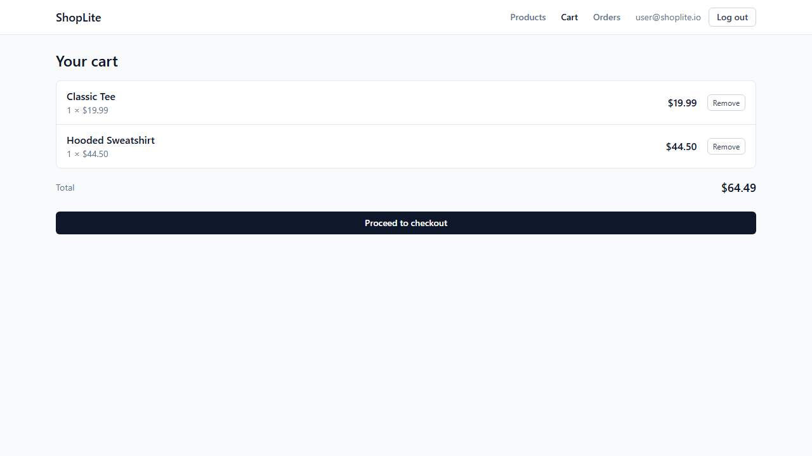
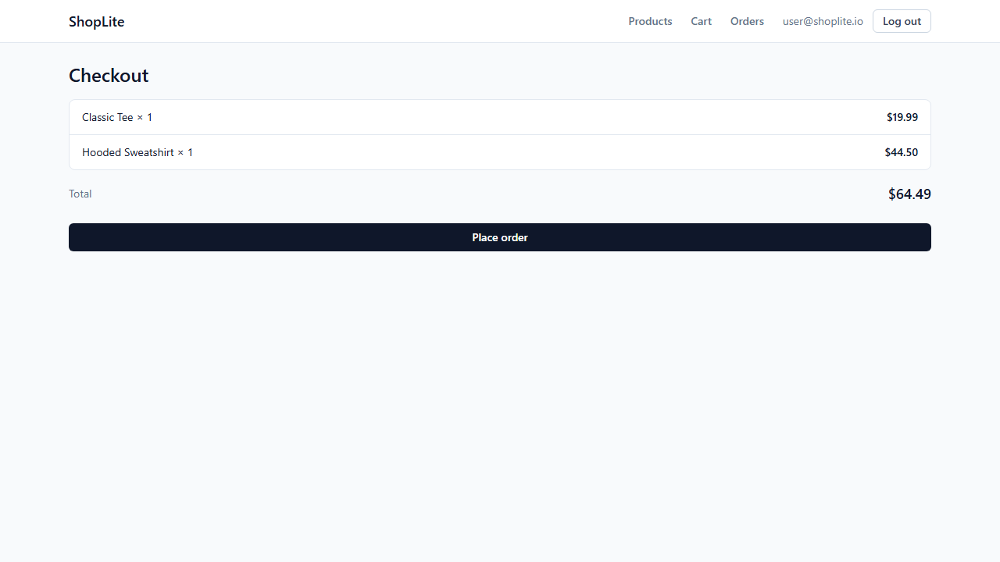
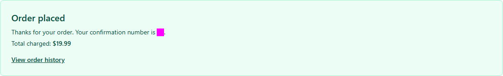
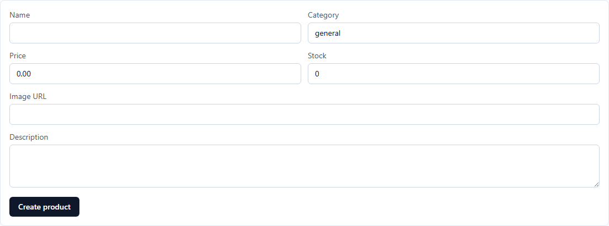
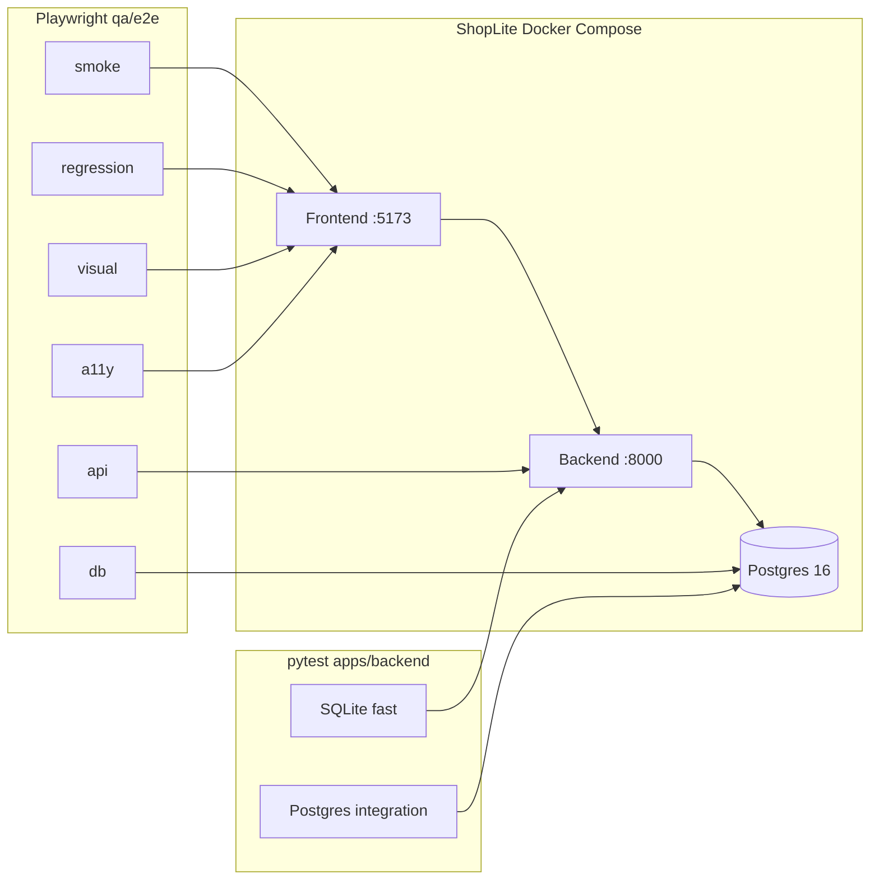
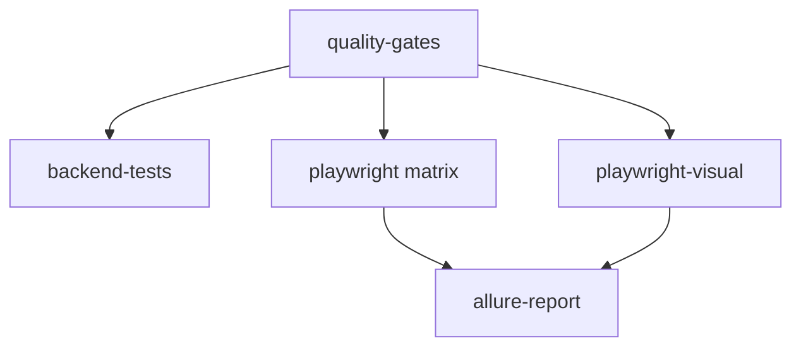

# TestForge

TestForge is a full-stack QA reference project: a working e-commerce app (**ShopLite**) plus the automation that validates it. Clone the repo, start Docker, and run roughly **120 functional tests** and **4 k6 load scripts** against a live stack—no external services or paid accounts.

The app is intentionally small (seven pages, fifteen HTTP routes, five database tables) but behaves like a real product: JWT auth, role-based admin, cart merge rules, concurrency-safe checkout, and soft-deleted catalog items. The test layer mirrors how a team would structure Playwright and pytest in production: Page Object Model, API-based setup, deterministic seeds, tagged suites, Allure reporting, and GitHub Actions with quality gates.

**At a glance**

| | |
|---|---|
| Functional tests | 120 (Playwright + pytest) |
| Load scripts | 4 (k6, manual workflow) |
| PR CI | Typecheck, build, lint, pytest, smoke / API / regression / a11y / visual (Chromium), merged Allure |
| Deep reference | [`project.md`](./project.md) — every endpoint, test name, and config file |

## Contents

- [ShopLite in screenshots](#shoplite-in-screenshots)
- [What this repository contains](#what-this-repository-contains)
- [ShopLite application](#shoplite-application)
- [Test automation framework](#test-automation-framework)
- [Architecture](#architecture)
- [Repository structure](#repository-structure)
- [Tech stack](#tech-stack)
- [Test inventory](#test-inventory)
- [Run the application](#run-the-application)
- [Run tests](#run-tests)
- [Reports and artifacts](#reports-and-artifacts)
- [Continuous integration](#continuous-integration)
- [Performance tests](#performance-tests)
- [Visual regression](#visual-regression)
- [Security and limitations](#security-and-limitations)
- [Documentation](#documentation)

## ShopLite in screenshots

These images match the Playwright visual baselines in [`qa/e2e/tests/visual/pages.visual.spec.ts-snapshots/`](./qa/e2e/tests/visual/pages.visual.spec.ts-snapshots/). They show the UI states the suite locks for regression.

### Login

Unauthenticated entry point. Smoke tests cover valid and invalid login; regression tests cover session persistence and logout.



### Product catalog

Twenty seeded products with price, stock, and out-of-stock labelling. Tests assert grid load, navigation to detail, and disabled add-to-cart when `stock` is zero.



### Cart

Authenticated cart with line items, per-line remove, running total, and checkout CTA. DB tests verify the `(user_id, product_id)` unique constraint and merge-on-add behaviour.



### Checkout

Order review before submit. Regression tests assert empty-cart state, stock decrement, and rejection when quantity exceeds available stock.



### Order confirmation

Shown after `POST /api/checkout` succeeds. The order id is masked in visual snapshots because it is dynamic.



### Admin products

Admin-only CRUD for the catalog. Regular users receive 403 from the API and are redirected from the route. Deletes are soft (`is_active=false`) so past orders keep their line-item snapshots.



## What this repository contains

| Piece | Role |
|-------|------|
| **ShopLite** (`apps/frontend`, `apps/backend`) | React + FastAPI store you can run locally or in CI |
| **Playwright framework** (`qa/e2e`) | UI, API, DB, a11y, and visual tests with POM and fixtures |
| **Backend tests** (`apps/backend/tests`) | Fast pytest suite on SQLite; Postgres integration tests for transactions |
| **k6 scripts** (`qa/perf`) | Smoke-load checks on API latency (optional workflow) |
| **QA docs** (`qa/docs`) | Test plan, strategy, coverage matrix, flake policy |
| **CI** (`.github/workflows`) | `ci.yml` on every PR; `perf.yml` on demand |

Out of scope by design: real payments, email, shipping, mobile native apps, and production-grade security hardening.

## ShopLite application

### Pages and routes

| Path | Purpose | Auth |
|------|---------|------|
| `/login` | Email/password sign-in | Public |
| `/products` | Product grid (20 seeded items) | Public |
| `/products/:id` | Product detail and add to cart | Public |
| `/cart` | Line items and totals | User |
| `/checkout` | Review and place order | User |
| `/orders` | Order history | User |
| `/admin/products` | Create, edit, soft-delete products | Admin |

The frontend is served on port **5173** (nginx in Docker proxies `/api` to the backend). The API listens on **8000** with OpenAPI at `/docs`.

### API surface (summary)

| Area | Endpoints (examples) |
|------|----------------------|
| Health | `GET /health` |
| Auth | `POST /api/auth/login`, `GET /api/auth/me` |
| Catalog | `GET /api/products`, `GET /api/products/{id}` |
| Cart | `GET/POST/DELETE /api/cart/items` |
| Checkout | `POST /api/checkout` |
| Orders | `GET /api/orders`, `GET /api/orders/{id}` |
| Admin | `POST/PATCH/DELETE /api/admin/products` |

Full route list and schemas: [`project.md` §4](./project.md#4-backend-fastapi).

### Behaviour worth testing

- **Checkout** uses an atomic `UPDATE … WHERE stock >= quantity` per line. Concurrent purchases cannot drive stock negative; the Postgres integration suite proves it with threaded clients.
- **Admin delete** sets `is_active=false` and `deleted_at`. Inactive products disappear from the public catalog but remain on historical `order_items` (name and price stored at purchase time).
- **Cart** merges duplicate product rows via a unique constraint on `(user_id, product_id)`.

### Data and seeds

PostgreSQL 16 runs in Compose. On backend start, Alembic migrates and seeds run idempotently: **3 users**, **20 products**.

| Email | Password | Role |
|-------|----------|------|
| `admin@shoplite.io` | `admin123` | admin |
| `user@shoplite.io` | `user1234` | user |
| `alice@shoplite.io` | `alice123` | user |

Credentials are demo-only and live in `apps/backend/app/seeds/seed.py`.

## Test automation framework

### Layout (`qa/e2e`)

| Folder | Purpose |
|--------|---------|
| `pages/` | Page Object Model — locators and actions only |
| `fixtures/` | Merged test fixture (`test.ts`) and auth helpers |
| `factories/` | Canonical accounts and product factories on top of seeds |
| `tests/smoke`, `regression`, `api`, `db`, `a11y`, `visual` | Tagged suites |
| `utils/` | API client, DB client, shared assertions |
| `scripts/reset-db.mjs` | Truncate and reseed between spec files |
| `global-setup.ts` | Health check + Allure environment metadata |

### Conventions

- **Auth:** Fixtures call `POST /api/auth/login` and inject the JWT into `localStorage` via `addInitScript`. UI login is tested in specs, not used as setup.
- **Data:** Seeds are canonical; factories create ad-hoc products or users when a test needs isolation.
- **Stability:** No hard waits; web-first assertions; `retries: 2` in CI only; screenshot, video, and trace on failure.
- **Selectors:** Components expose `data-testid`; page objects are the only place tests reference them.

### Page objects

| File | Covers |
|------|--------|
| `LoginPage.ts` | Sign-in form and errors |
| `ProductsPage.ts` | Catalog grid |
| `ProductDetailsPage.ts` | Detail view and add to cart |
| `CartPage.ts` | Line items, totals, remove |
| `CheckoutPage.ts` | Review, submit, confirmation |
| `OrdersPage.ts` | Order history |
| `AdminProductsPage.ts` | Admin CRUD form and table |
| `NavBar.ts` | Navigation, logout, admin link |

### Tags

| Tag | Use |
|-----|-----|
| `@smoke` | Short critical path; runs on every PR |
| `@regression` | Broader UI behaviour |
| `@api` | HTTP contracts without a browser |
| `@db` | Direct Postgres assertions |
| `@a11y` | axe-core WCAG 2.1 AA (`critical` + `serious` fail the build) |
| `@visual` | Chromium screenshot comparison |
| `@postgres` | Backend pytest marker for integration tests |

Doctrine and flake rules: [`qa/docs/qa-strategy.md`](./qa/docs/qa-strategy.md), [`qa/docs/flake-policy.md`](./qa/docs/flake-policy.md).

## Architecture



## Repository structure

```
testforge/
├── apps/
│   ├── frontend/              React 18, Vite, Tailwind, React Query, Zustand
│   │   └── src/pages/         login, products, cart, checkout, orders, admin
│   └── backend/               FastAPI, SQLAlchemy, Alembic, JWT
│       ├── app/api/           auth, products, cart, checkout, orders, admin
│       ├── app/services/      business logic
│       ├── app/seeds/         deterministic test data
│       └── tests/             pytest (SQLite + Postgres integration)
├── qa/
│   ├── e2e/                   Playwright framework (see above)
│   ├── perf/                  k6 scripts + README
│   └── docs/                  test plan, strategy, coverage matrix, flake policy
├── docs/screenshots/          UI images for this README
├── .github/workflows/         ci.yml, perf.yml
├── docker-compose.yml
├── README.md                  you are here
├── project.md                 full technical inventory
└── CLAUDE.md                  contributor coding rules
```

## Tech stack

| Layer | Technology |
|-------|------------|
| Frontend | React 18, TypeScript (strict), Vite, Tailwind, React Query, Zustand, React Router |
| Backend | FastAPI, Python 3.12, SQLAlchemy 2.x, Alembic, Pydantic v2, JWT (HS256), bcrypt |
| Database | PostgreSQL 16 (Docker); SQLite for in-process pytest |
| E2E / API | Playwright, TypeScript |
| Accessibility | `@axe-core/playwright` |
| Visual | Playwright `toHaveScreenshot()` (Chromium) |
| Load | k6 |
| Reports | Playwright HTML, Allure (`allure-playwright` + Java CLI) |
| CI | GitHub Actions, Docker Compose per job |
| Lint | ruff (Python), `tsc` (frontend + e2e) |

## Test inventory

| Suite | Spec files | Tests | Tag / marker | Location |
|-------|------------|------:|--------------|----------|
| Smoke (UI) | 4 | 8 | `@smoke` | [`qa/e2e/tests/smoke/`](./qa/e2e/tests/smoke/) |
| Regression (UI) | 9 | 36 | `@regression` | [`qa/e2e/tests/regression/`](./qa/e2e/tests/regression/) |
| API | 6 | 35 | `@api` | [`qa/e2e/tests/api/`](./qa/e2e/tests/api/) |
| Database | 4 | 12 | `@db` | [`qa/e2e/tests/db/`](./qa/e2e/tests/db/) |
| Accessibility | 1 | 7 | `@a11y` | [`qa/e2e/tests/a11y/`](./qa/e2e/tests/a11y/) |
| Visual | 1 | 6 | `@visual` | [`qa/e2e/tests/visual/`](./qa/e2e/tests/visual/) |
| Backend (SQLite) | 4 | 10 | pytest | [`apps/backend/tests/`](./apps/backend/tests/) |
| Backend (Postgres) | 1 | 6 | `@postgres` | [`apps/backend/tests/integration/`](./apps/backend/tests/integration/) |
| **Total (functional)** | **30** | **120** | | |
| k6 scenarios | 4 | 4 | — | [`qa/perf/`](./qa/perf/) |

Named test list: [`project.md` §7](./project.md#7-test-inventory-every-test-named). Feature matrix: [`qa/docs/coverage-matrix.md`](./qa/docs/coverage-matrix.md).

## Run the application

```powershell
copy .env.example .env    # optional; defaults work locally
docker compose up --build
```

| URL | Service |
|-----|---------|
| http://localhost:5173 | Frontend |
| http://localhost:8000/health | Backend health |
| http://localhost:8000/docs | Swagger UI |

```powershell
docker compose down              # stop, keep volume
docker compose down -v           # stop, wipe data
docker compose exec backend python -m app.seeds.seed --reset
docker compose logs -f backend
```

## Run tests

### Prerequisites

- Stack running for Playwright and k6 tests that hit the API.
- Node 22, Python 3.12, Java 17+ (for local Allure HTML).

```powershell
cd qa\e2e
npm install
npx playwright install
```

### Playwright

| Command | Description |
|---------|-------------|
| `npm run test:smoke` | Critical path; resets DB first |
| `npm run test:regression` | Full UI regression |
| `npm run test:api` | HTTP contracts (no browser) |
| `npm run test:db` | Postgres checks via `pg` |
| `npm run test:a11y` | axe scans all main pages |
| `npm run test:visual` | Screenshot compare (Chromium) |
| `npm run test:visual:update` | Regenerate baselines after UI change |
| `npm run test:browsers` | Chromium + Firefox + WebKit |
| `npm test` | Entire Playwright suite |

PR CI uses Chromium only. Run `test:browsers` locally for cross-browser signal.

### Backend (pytest)

```powershell
cd apps\backend
python -m venv .venv
.\.venv\Scripts\Activate.ps1
pip install -r requirements.txt
pytest -v                    # 10 tests, SQLite, no Docker
pytest -m postgres -v        # 6 tests, requires Postgres from Compose
```

### k6

```powershell
k6 run qa/perf/products.js
k6 run qa/perf/login.js
k6 run qa/perf/cart.js
k6 run qa/perf/checkout.js
```

Not on the default PR path. Use [`.github/workflows/perf.yml`](./.github/workflows/perf.yml) or see [`qa/perf/README.md`](./qa/perf/README.md).

## Reports and artifacts

Every Playwright run writes results to disk: two report formats plus per-failure triage files. Output directories are gitignored.

### Playwright HTML report

Configured in `playwright.config.ts` (`list` + `html`). Output: `qa/e2e/playwright-report/`.

```powershell
cd qa\e2e
npm test
npm run report              # opens playwright-report/index.html
```

### Allure report

`allure-playwright` writes JSON to `qa/e2e/allure-results/`. `global-setup.ts` seeds `environment.properties` (base URL, OS, Node, CI flag, timestamp) and copies [`qa/e2e/allure/categories.json`](./qa/e2e/allure/categories.json).

```powershell
cd qa\e2e
npm test
npm run report:allure:generate
npm run report:allure:open
npm run report:allure:serve     # dev server from raw results
npm run report:allure           # generate + open
```

**Allure categories**

| Category | Typical cause |
|----------|----------------|
| Product defects | Failed assertions (text, visibility, URL, screenshots) |
| Test defects | Broken fixtures or setup |
| Flaky tests | Passed after CI retry |
| Accessibility violations | axe critical/serious |
| Visual regressions | Screenshot mismatch |

### Failure triage (Playwright)

| Artifact | Config | Location |
|----------|--------|----------|
| Screenshot | `only-on-failure` | `test-results/<spec>/test-failed-1.png` |
| Video | `retain-on-failure` | `test-results/<spec>/video.webm` |
| Trace | `retain-on-failure` | `test-results/<spec>/trace.zip` |

```powershell
npx playwright show-trace qa\e2e\test-results\<spec>\trace.zip
```

### CI artifacts

Download from the workflow run **Summary → Artifacts**.

| Artifact | Contents |
|----------|----------|
| `playwright-report-<suite>` | HTML per matrix suite |
| `playwright-report-visual` | HTML for visual job |
| `allure-results-*` | Raw Allure JSON per job |
| `allure-report` | Single merged Allure HTML |
| `test-artifacts-<suite>` | Failure screenshots, videos, traces |
| `visual-diffs` | Visual comparison output |
| `visual-snapshots-linux` | Regenerated Linux baselines (manual workflow only) |
| `docker-logs-<suite>` | Compose logs when a job fails |
| `k6-summaries` | k6 JSON summaries (`perf.yml` only) |

The `allure-report` job merges every `allure-results-*` upload before generating HTML once.

## Continuous integration

[`.github/workflows/ci.yml`](./.github/workflows/ci.yml) — push and pull requests to `main`.



| Job | What runs |
|-----|-----------|
| `quality-gates` | Frontend `npm install`, typecheck, Vite build; e2e `tsc`; backend `ruff` |
| `backend-tests` | `pytest -v` (SQLite) |
| `playwright-smoke` | Compose up → `@smoke` |
| `playwright-api` | `@api` |
| `playwright-regression` | `@regression` |
| `accessibility` | `@a11y` |
| `playwright-visual` | `@visual`; Linux snapshots via Actions cache |
| `allure-report` | Merge Allure results from all Playwright jobs |

`quality-gates` blocks downstream jobs. Each Playwright job builds its own Compose stack. `allure-report` runs with `if: always()` after Playwright finishes.

**Visual baselines:** Repo commits Windows Chromium PNGs (`*-chromium-win32.png`). Ubuntu CI uses Linux snapshots (cache on first run). To refresh: Actions → CI → Run workflow → **Regenerate Linux visual snapshots** → download `visual-snapshots-linux` and commit `*-chromium-linux.png` if you want them in git.

**Load tests:** [`.github/workflows/perf.yml`](./.github/workflows/perf.yml) (`workflow_dispatch`, script selector).

## Performance tests

k6 exercises the API under light, fixed load on a single Docker host. Useful for regression on latency, not capacity planning.

| Script | Endpoint | Profile |
|--------|----------|---------|
| `products.js` | `GET /api/products` | ramp to 10 VUs |
| `login.js` | `POST /api/auth/login` | ramp to 5 VUs |
| `cart.js` | `POST /api/cart/items` | ramp to 5 VUs |
| `checkout.js` | `POST /api/checkout` | 1 VU (cart cleared each iteration) |

Typical thresholds: p95 under 500–800 ms, error rate under 1%. Details: [`qa/perf/README.md`](./qa/perf/README.md).

## Visual regression

Six full-page or component screenshots (see [ShopLite in screenshots](#shoplite-in-screenshots)). Chromium only; `maxDiffPixelRatio: 0.01` in config. Order confirmation masks the dynamic order id.

```powershell
cd qa\e2e
npm run test:visual
npm run test:visual:update
```

## Security and limitations

Portfolio / demo scope—not production hardened.

| Topic | Current state |
|-------|----------------|
| JWT storage | `localStorage` (easy for tests; XSS risk in production) |
| Seed passwords | In source for reproducibility |
| CORS | Local frontend origin in Compose defaults |
| Rate limiting | None on login |
| a11y gate | `critical` and `serious` only |
| Allure locally | Requires Java |
| CI cost | Each Playwright job starts its own Compose stack |
| k6 checkout | Single VU to avoid cart races on one seed user |

## Documentation

| Document | Description |
|----------|-------------|
| [`qa/docs/test-plan.md`](./qa/docs/test-plan.md) | Scope and entry criteria |
| [`qa/docs/coverage-matrix.md`](./qa/docs/coverage-matrix.md) | Feature × test type |
| [`qa/docs/qa-strategy.md`](./qa/docs/qa-strategy.md) | Pyramid, tagging, conventions |
| [`qa/docs/flake-policy.md`](./qa/docs/flake-policy.md) | Stability rules |
| [`qa/docs/release-checklist.md`](./qa/docs/release-checklist.md) | Pre-release checks |
| [`qa/perf/README.md`](./qa/perf/README.md) | k6 install and thresholds |
| [`project.md`](./project.md) | Full inventory (routes, tests, configs) |
| [`CLAUDE.md`](./CLAUDE.md) | Coding rules for contributors |
